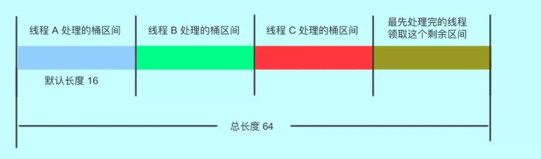
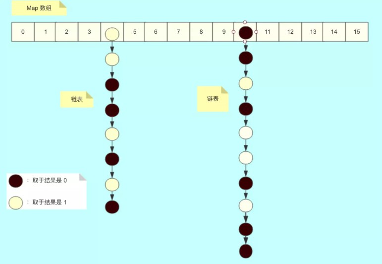
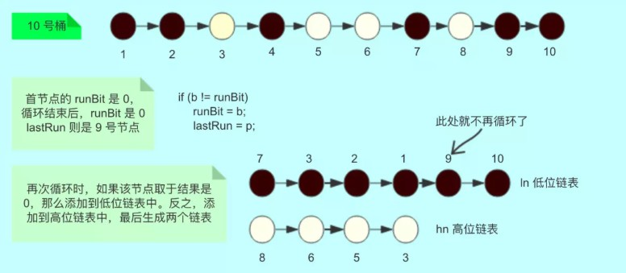
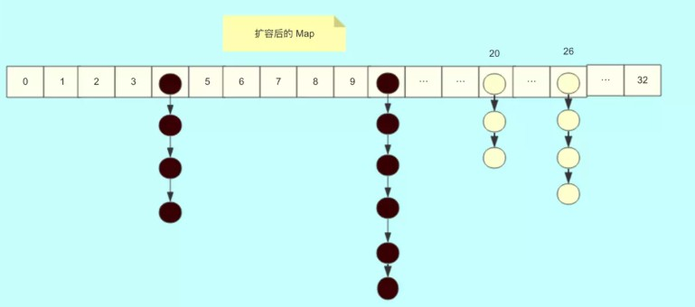

#### ConcurrentHashMap JDK11实现

JDK1.8的实现已经摒弃了Segment的概念，而是直接用Node数组+链表+红黑树的数据结构来实现，并发控制使用Synchronized和CAS来操作，整个看起来就像是优化过且线程安全的HashMap，虽然在JDK1.8中还能看到Segment的数据结构，但是已经简化了属性，只是为了兼容旧版本。

***

#### 内部结构及核心组成  
Node是ConcurrentHashMap存储结构的基本单元，继承于HashMap中的Entry，用于存储数据，数据结构很简单，其实是一个链表，但是只允许对数据进行查找，不允许进行修改，源代码如下:
```
  static class Node<K,V> implements Map.Entry<K,V> {
        //链表的数据结构
        final int hash;
        final K key;
        //val和next都会在扩容时发生变化，所以加上volatile来保持可见性和禁止重排序
        volatile V val;
        volatile Node<K,V> next;

        Node(int hash, K key, V val) {
            this.hash = hash;
            this.key = key;
            this.val = val;
        }

        Node(int hash, K key, V val, Node<K,V> next) {
            this(hash, key, val);
            this.next = next;
        }

        public final K getKey()     { return key; }
        public final V getValue()   { return val; }
        public final int hashCode() { return key.hashCode() ^ val.hashCode(); }
        public final String toString() {
            return Helpers.mapEntryToString(key, val);
        }
        //不允许更新value 
        public final V setValue(V value) {
            throw new UnsupportedOperationException();
        }

        public final boolean equals(Object o) {
            Object k, v, u; Map.Entry<?,?> e;
            return ((o instanceof Map.Entry) &&
                    (k = (e = (Map.Entry<?,?>)o).getKey()) != null &&
                    (v = e.getValue()) != null &&
                    (k == key || k.equals(key)) &&
                    (v == (u = val) || v.equals(u)));
        }

        /**
         * Virtualized support for map.get(); overridden in subclasses.
         */
        Node<K,V> find(int h, Object k) {
            Node<K,V> e = this;
            if (k != null) {
                do {
                    K ek;
                    if (e.hash == h &&
                        ((ek = e.key) == k || (ek != null && k.equals(ek))))
                        return e;
                } while ((e = e.next) != null);
            }
            return null;
        }
    }
```

TreeNode继承与Node，但是数据结构换成了二叉树结构，它是红黑树的数据的存储结构，用于红黑树中存储数据，当链表的节点数大于8时会转换成红黑树的结构，就是通过TreeNode作为存储结构代替Node来转换成黑红树，源代码如下：
```
static final class TreeNode<K,V> extends Node<K,V> {
        //树形结构的属性定义
        TreeNode<K,V> parent;  // red-black tree links
        TreeNode<K,V> left;
        TreeNode<K,V> right;
        TreeNode<K,V> prev;    // needed to unlink next upon deletion
        boolean red;//标志红黑树的红节点

        TreeNode(int hash, K key, V val, Node<K,V> next,
                 TreeNode<K,V> parent) {
            super(hash, key, val, next);
            this.parent = parent;
        }

        Node<K,V> find(int h, Object k) {
            return findTreeNode(h, k, null);
        }

        /**
         * Returns the TreeNode (or null if not found) for the given key
         * starting at given root.
         */
          //根据key查找 从根节点开始找出相应的TreeNode，    
        final TreeNode<K,V> findTreeNode(int h, Object k, Class<?> kc) {
            if (k != null) {
                TreeNode<K,V> p = this;
                do {
                    int ph, dir; K pk; TreeNode<K,V> q;
                    TreeNode<K,V> pl = p.left, pr = p.right;
                    if ((ph = p.hash) > h)
                        p = pl;
                    else if (ph < h)
                        p = pr;
                    else if ((pk = p.key) == k || (pk != null && k.equals(pk)))
                        return p;
                    else if (pl == null)
                        p = pr;
                    else if (pr == null)
                        p = pl;
                    else if ((kc != null ||
                              (kc = comparableClassFor(k)) != null) &&
                             (dir = compareComparables(kc, k, pk)) != 0)
                        p = (dir < 0) ? pl : pr;
                    else if ((q = pr.findTreeNode(h, k, kc)) != null)
                        return q;
                    else
                        p = pl;
                } while (p != null);
            }
            return null;
        }
    }
```
TreeBin从字面含义中可以理解为存储树形结构的容器，而树形结构就是指TreeNode，所以TreeBin就是封装TreeNode的容器，它提供转换黑红树的一些条件和锁的控制，部分源码结构如下:
```
static final class TreeBin<K,V> extends Node<K,V> {
    //指向TreeNode列表和根节点
    TreeNode<K,V> root;
    volatile TreeNode<K,V> first;
    volatile Thread waiter;
    volatile int lockState;
    // 读写锁状态
    static final int WRITER = 1; // 获取写锁的状态
    static final int WAITER = 2; // 等待写锁的状态
    static final int READER = 4; // 增加数据时读锁的状态
    /**
     * 初始化红黑树
     */
    TreeBin(TreeNode<K,V> b) {
        super(TREEBIN, null, null, null);
        this.first = b;
        TreeNode<K,V> r = null;
        for (TreeNode<K,V> x = b, next; x != null; x = next) {
            next = (TreeNode<K,V>)x.next;
            x.left = x.right = null;
            if (r == null) {
                x.parent = null;
                x.red = false;
                r = x;
            }
            else {
                K k = x.key;
                int h = x.hash;
                Class<?> kc = null;
                for (TreeNode<K,V> p = r;;) {
                    int dir, ph;
                    K pk = p.key;
                    if ((ph = p.hash) > h)
                        dir = -1;
                    else if (ph < h)
                        dir = 1;
                    else if ((kc == null &&
                              (kc = comparableClassFor(k)) == null) ||
                             (dir = compareComparables(kc, k, pk)) == 0)
                        dir = tieBreakOrder(k, pk);
                        TreeNode<K,V> xp = p;
                    if ((p = (dir <= 0) ? p.left : p.right) == null) {
                        x.parent = xp;
                        if (dir <= 0)
                            xp.left = x;
                        else
                            xp.right = x;
                        r = balanceInsertion(r, x);
                        break;
                    }
                }
            }
        }
        this.root = r;
        assert checkInvariants(root);
    }
    ......
}
```
*** 
#### 初始化
```
public ConcurrentHashMap() {
    }
```
ConcurrentHashMap的初始化其实是一个空实现，并没有做任何事，这里后面会讲到，这也是和其他的集合类有区别的地方，初始化操作并不是在构造函数实现的，而是在put操作中实现，当然ConcurrentHashMap还提供了其他的构造函数，有指定容量大小或者指定负载因子，跟HashMap一样，只是对容量大小和负载因子进行赋值。
*** 

#### put操作

```
public V put(K key, V value) {
        return putVal(key, value, false);
    }

    /** Implementation for put and putIfAbsent */
    final V putVal(K key, V value, boolean onlyIfAbsent) {
        if (key == null || value == null) throw new NullPointerException();
        int hash = spread(key.hashCode());  //两次hash，减少hash冲突，可以均匀分布
        int binCount = 0;
        for (Node<K,V>[] tab = table;;) { //对这个table进行迭代
            Node<K,V> f; int n, i, fh; K fk; V fv;
            //这里就是上面构造方法没有进行初始化，在这里进行判断，为null就调用initTable进行初始化，属于懒汉模式初始化
            if (tab == null || (n = tab.length) == 0)
                tab = initTable();
            else if ((f = tabAt(tab, i = (n - 1) & hash)) == null) {//如果i位置没有数据，就直接CAS插入
                if (casTabAt(tab, i, null, new Node<K,V>(hash, key, value)))
                    break;                   // no lock when adding to empty bin
            }
            else if ((fh = f.hash) == MOVED) //如果在进行扩容，则先进行扩容操作
                tab = helpTransfer(tab, f);
            else if (onlyIfAbsent // 检查第一个节点是否锁定
                     && fh == hash
                     && ((fk = f.key) == key || (fk != null && key.equals(fk)))
                     && (fv = f.val) != null)
                return fv;
            else {
                V oldVal = null;
                //如果以上条件都不满足，那就要进行加锁操作，也就是存在hash冲突，锁住链表或者红黑树的头结点
                synchronized (f) {
                    if (tabAt(tab, i) == f) {
                        if (fh >= 0) {//表示该节点是链表结构
                            binCount = 1;
                            for (Node<K,V> e = f;; ++binCount) {
                                K ek;
                                //这里涉及到相同的key进行put就会覆盖原先的value
                                if (e.hash == hash &&
                                    ((ek = e.key) == key ||
                                     (ek != null && key.equals(ek)))) {
                                    oldVal = e.val;
                                    if (!onlyIfAbsent)
                                        e.val = value;
                                    break;
                                }
                                Node<K,V> pred = e;
                                if ((e = e.next) == null) {//插入链表尾部
                                    pred.next = new Node<K,V>(hash, key, value);
                                    break;
                                }
                            }
                        }
                        else if (f instanceof TreeBin) {//红黑树结构
                            Node<K,V> p;
                            binCount = 2; //红黑树结构旋转插入
                            if ((p = ((TreeBin<K,V>)f).putTreeVal(hash, key,
                                                           value)) != null) {
                                oldVal = p.val;
                                if (!onlyIfAbsent)
                                    p.val = value;
                            }
                        }
                        else if (f instanceof ReservationNode)
                            throw new IllegalStateException("Recursive update");
                    }
                }
                if (binCount != 0) {
                    //如果链表的长度大于8时就会进行红黑树的转换
                    if (binCount >= TREEIFY_THRESHOLD)
                        treeifyBin(tab, i);
                    if (oldVal != null)
                        return oldVal;
                    break;
                }
            }
        }
        addCount(1L, binCount);//统计size，并且检查是否需要扩容
        return null;
    }
```

这个put的过程很清晰，对当前的table进行无条件自循环直到put成功，可以分成以下六步流程来概述:

1.如果没有初始化就先调用initTable()方法来进行初始化过程  
2.如果没有hash冲突就直接CAS插入  
3.如果还在进行扩容操作就先进行扩容  
4.如果存在hash冲突，就加锁来保证线程安全，这里有两种情况，一种是链表形式就直接遍历到尾端插入，一种是红黑树就按照红黑树结构插入  
5.最后一个如果该链表的数量大于阈值8，就要先转换成黑红树的结构，break再一次进入循环  
6.如果添加成功就调用addCount()方法统计size，并且检查是否需要扩容  
7.现在我们来对每一步的细节进行源码分析，在第一步中，符合条件会进行初始化操作，我们来看看initTable()方法  

```
private final Node<K,V>[] initTable() {
        Node<K,V>[] tab; int sc;
        while ((tab = table) == null || tab.length == 0) {//空的table才能进入初始化操作
            if ((sc = sizeCtl) < 0)//sizeCtl<0表示其他线程已经在初始化了或者扩容了，挂起当前线程
                Thread.yield(); // lost initialization race; just spin
            else if (U.compareAndSetInt(this, SIZECTL, sc, -1)) {//CAS操作SIZECTL为-1，表示初始化状态
                try {
                    if ((tab = table) == null || tab.length == 0) {
                        int n = (sc > 0) ? sc : DEFAULT_CAPACITY;
                        @SuppressWarnings("unchecked")
                        Node<K,V>[] nt = (Node<K,V>[])new Node<?,?>[n];//初始化
                        table = tab = nt;
                        sc = n - (n >>> 2);//记录下次扩容的大小
                    }
                } finally {
                    sizeCtl = sc;
                }
                break;
            }
        }
        return tab;
    }

```
在第二步中没有hash冲突就直接调用Unsafe的方法CAS插入该元素，进入第三步如果容器正在扩容，则会调用helpTransfer（）方法帮助扩容，现在我们跟进helpTransfer()方法看看
```
final Node<K,V>[] helpTransfer(Node<K,V>[] tab, Node<K,V> f) {
        Node<K,V>[] nextTab; int sc;
        if (tab != null && (f instanceof ForwardingNode) &&
            (nextTab = ((ForwardingNode<K,V>)f).nextTable) != null) {//新的table nextTab已经存在前提下才能帮助扩容
            int rs = resizeStamp(tab.length);
            while (nextTab == nextTable && table == tab &&
                   (sc = sizeCtl) < 0) {
                if ((sc >>> RESIZE_STAMP_SHIFT) != rs || sc == rs + 1 ||
                    sc == rs + MAX_RESIZERS || transferIndex <= 0)
                    break;
                if (U.compareAndSetInt(this, SIZECTL, sc, sc + 1)) {
                    transfer(tab, nextTab);//调用扩容方法
                    break;
                }
            }
            return nextTab;
        }
        return table;
    }
```
其实helpTransfer()方法的目的就是调用多个工作线程一起帮助进行扩容，这样的效率就会更高，而不是只有检查到要扩容的那个线程进行扩容操作，其他线程就要等待扩容操作完成才能工作

既然这里涉及到扩容的操作，我们也一起来看看扩容方法transfer()

```
/**
 * Moves and/or copies the nodes in each bin to new table. See
 * above for explanation.
 * 
 * transferIndex 表示转移时的下标，初始为扩容前的 length。
 * 
 * 我们假设长度是 32
 */
private final void transfer(Node<K,V>[] tab, Node<K,V>[] nextTab) {
    int n = tab.length, stride;
    // 将 length / 8 然后除以 CPU核心数。如果得到的结果小于 16，那么就使用 16。
    // 这里的目的是让每个 CPU 处理的桶一样多，避免出现转移任务不均匀的现象，如果桶较少的话， 
    默认一个 CPU（一个线程）处理 16 个桶
    if ((stride = (NCPU > 1) ? (n >>> 3) / NCPU : n) < MIN_TRANSFER_STRIDE)
        stride = MIN_TRANSFER_STRIDE; // subdivide range 细分范围 stridea：TODO
    // 新的 table 尚未初始化
    if (nextTab == null) {            // initiating
        try {
            // 扩容  2 倍
            Node<K,V>[] nt = (Node<K,V>[])new Node<?,?>[n << 1];
            // 更新
            nextTab = nt;
        } catch (Throwable ex) {      // try to cope with OOME
            // 扩容失败， sizeCtl 使用 int 最大值。
            sizeCtl = Integer.MAX_VALUE;
            return;// 结束
        }
        // 更新成员变量
        nextTable = nextTab;
        // 更新转移下标，就是 老的 tab 的 length
        transferIndex = n;
    }
    // 新 tab 的 length
    int nextn = nextTab.length;
    // 创建一个 fwd 节点，用于占位。当别的线程发现这个槽位中是 fwd 类型的节点，则跳过这个节点。
    ForwardingNode<K,V> fwd = new ForwardingNode<K,V>(nextTab);
    // 首次推进为 true，如果等于 true，说明需要再次推进一个下标（i--），反之，如果是 false，那么就不能推进下标，  
    需要将当前的下标处理完毕才能继续推进
    boolean advance = true;
    // 完成状态，如果是 true，就结束此方法。
    boolean finishing = false; // to ensure sweep before committing nextTab
    // 死循环,i 表示下标，bound 表示当前线程可以处理的当前桶区间最小下标
    for (int i = 0, bound = 0;;) {
        Node<K,V> f; int fh;
        // 如果当前线程可以向后推进；这个循环就是控制 i 递减。
        同时，每个线程都会进入这里取得自己需要转移的桶的区间
        while (advance) {
            int nextIndex, nextBound;
            // 对 i 减一，判断是否大于等于 bound （正常情况下，如果大于 bound 不成立，
            说明该线程上次领取的任务已经完成了。那么，需要在下面继续领取任务）
            // 如果对 i 减一大于等于 bound（还需要继续做任务），或者完成了，
            修改推进状态为 false，不能推进了。任务成功后修改推进状态为 true。
            // 通常，第一次进入循环，i-- 这个判断会无法通过，从而走下面的 nextIndex 赋值操作（获取最新的转移下标）。
            其余情况都是：如果可以推进，将 i 减一，然后修改成不可推进。如果 i 对应的桶处理成功了，改成可以推进。
            if (--i >= bound || finishing)
                advance = false;// 这里设置 false，是为了防止在没有成功处理一个桶的情况下却进行了推进
            // 这里的目的是：1. 当一个线程进入时，会选取最新的转移下标。2. 当一个线程处理完自己的区间时，
            如果还有剩余区间的没有别的线程处理。再次获取区间。
            else if ((nextIndex = transferIndex) <= 0) {
                // 如果小于等于0，说明没有区间了 ，i 改成 -1，推进状态变成 false，不再推进，表示，扩容结束了，  
                当前线程可以退出了
                // 这个 -1 会在下面的 if 块里判断，从而进入完成状态判断
                i = -1;
                advance = false;// 这里设置 false，是为了防止在没有成功处理一个桶的情况下却进行了推进
            }// CAS 修改 transferIndex，即 length - 区间值，留下剩余的区间值供后面的线程使用
            else if (U.compareAndSwapInt
                     (this, TRANSFERINDEX, nextIndex,
                      nextBound = (nextIndex > stride ?
                                   nextIndex - stride : 0))) {
                bound = nextBound;// 这个值就是当前线程可以处理的最小当前区间最小下标
                i = nextIndex - 1; // 初次对i 赋值，这个就是当前线程可以处理的当前区间的最大下标
                advance = false; // 这里设置 false，是为了防止在没有成功处理一个桶的情况下却进行了推进，
                这样对导致漏掉某个桶。下面的 if (tabAt(tab, i) == f) 判断会出现这样的情况。
            }
        }// 如果 i 小于0 （不在 tab 下标内，按照上面的判断，领取最后一段区间的线程扩容结束）
        //  如果 i >= tab.length(不知道为什么这么判断)
        //  如果 i + tab.length >= nextTable.length  （不知道为什么这么判断）
        if (i < 0 || i >= n || i + n >= nextn) {
            int sc;
            if (finishing) { // 如果完成了扩容
                nextTable = null;// 删除成员变量
                table = nextTab;// 更新 table
                sizeCtl = (n << 1) - (n >>> 1); // 更新阈值
                return;// 结束方法。
            }// 如果没完成
            if (U.compareAndSwapInt(this, SIZECTL, sc = sizeCtl, sc - 1)) {
                // 尝试将 sc -1. 表示这个线程结束帮助扩容了，将 sc 的低 16 位减一。
                if ((sc - 2) != resizeStamp(n) << RESIZE_STAMP_SHIFT)
                // 如果 sc - 2 不等于标识符左移 16 位。如果他们相等了，说明没有线程在帮助他们扩容了。也就是说，扩容结束了。
                    return;// 不相等，说明没结束，当前线程结束方法。
                finishing = advance = true;// 如果相等，扩容结束了，更新 finising 变量
                i = n; // 再次循环检查一下整张表
            }
        }
        else if ((f = tabAt(tab, i)) == null) // 获取老 tab i 下标位置的变量，如果是 null，就使用 fwd 占位。
            advance = casTabAt(tab, i, null, fwd);// 如果成功写入 fwd 占位，再次推进一个下标
        else if ((fh = f.hash) == MOVED)// 如果不是 null 且 hash 值是 MOVED。
            advance = true; // already processed // 说明别的线程已经处理过了，再次推进一个下标
        else {// 到这里，说明这个位置有实际值了，且不是占位符。对这个节点上锁。
        为什么上锁，防止 putVal 的时候向链表插入数据
            synchronized (f) {
                // 判断 i 下标处的桶节点是否和 f 相同
                if (tabAt(tab, i) == f) {
                    Node<K,V> ln, hn;// low, height 高位桶，低位桶
                    // 如果 f 的 hash 值大于 0 。TreeBin 的 hash 是 -2
                    if (fh >= 0) {
                        // 对老长度进行与运算（第一个操作数的的第n位于第二个操作数的第n位如果都是1，那么结果的第n为也为1，否则为0）
                        // 由于 Map 的长度都是 2 的次方（000001000 这类的数字），那么取于 length 只有 2 种结果，一种是 0，一种是1
                        //  如果是结果是0 ，Doug Lea 将其放在低位，反之放在高位，目的是将链表重新 hash，放到对应的位置上，让新的取于算法能够击中他。
                        int runBit = fh & n;
                        Node<K,V> lastRun = f; // 尾节点，且和头节点的 hash 值取于不相等
                        // 遍历这个桶
                        for (Node<K,V> p = f.next; p != null; p = p.next) {
                            // 取于桶中每个节点的 hash 值
                            int b = p.hash & n;
                            // 如果节点的 hash 值和首节点的 hash 值取于结果不同
                            if (b != runBit) {
                                runBit = b; // 更新 runBit，用于下面判断 lastRun 该赋值给 ln 还是 hn。
                                lastRun = p; // 这个 lastRun 保证后面的节点与自己的取于值相同，避免后面没有必要的循环
                            }
                        }
                        if (runBit == 0) {// 如果最后更新的 runBit 是 0 ，设置低位节点
                            ln = lastRun;
                            hn = null;
                        }
                        else {
                            hn = lastRun; // 如果最后更新的 runBit 是 1， 设置高位节点
                            ln = null;
                        }// 再次循环，生成两个链表，lastRun 作为停止条件，这样就是避免无谓的循环（lastRun 后面都是相同的取于结果）
                        for (Node<K,V> p = f; p != lastRun; p = p.next) {
                            int ph = p.hash; K pk = p.key; V pv = p.val;
                            // 如果与运算结果是 0，那么就还在低位
                            if ((ph & n) == 0) // 如果是0 ，那么创建低位节点
                                ln = new Node<K,V>(ph, pk, pv, ln);
                            else // 1 则创建高位
                                hn = new Node<K,V>(ph, pk, pv, hn);
                        }
                        // 其实这里类似 hashMap 
                        // 设置低位链表放在新链表的 i
                        setTabAt(nextTab, i, ln);
                        // 设置高位链表，在原有长度上加 n
                        setTabAt(nextTab, i + n, hn);
                        // 将旧的链表设置成占位符
                        setTabAt(tab, i, fwd);
                        // 继续向后推进
                        advance = true;
                    }// 如果是红黑树
                    else if (f instanceof TreeBin) {
                        TreeBin<K,V> t = (TreeBin<K,V>)f;
                        TreeNode<K,V> lo = null, loTail = null;
                        TreeNode<K,V> hi = null, hiTail = null;
                        int lc = 0, hc = 0;
                        // 遍历
                        for (Node<K,V> e = t.first; e != null; e = e.next) {
                            int h = e.hash;
                            TreeNode<K,V> p = new TreeNode<K,V>
                                (h, e.key, e.val, null, null);
                            // 和链表相同的判断，与运算 == 0 的放在低位
                            if ((h & n) == 0) {
                                if ((p.prev = loTail) == null)
                                    lo = p;
                                else
                                    loTail.next = p;
                                loTail = p;
                                ++lc;
                            } // 不是 0 的放在高位
                            else {
                                if ((p.prev = hiTail) == null)
                                    hi = p;
                                else
                                    hiTail.next = p;
                                hiTail = p;
                                ++hc;
                            }
                        }
                        // 如果树的节点数小于等于 6，那么转成链表，反之，创建一个新的树
                        ln = (lc <= UNTREEIFY_THRESHOLD) ? untreeify(lo) :
                            (hc != 0) ? new TreeBin<K,V>(lo) : t;
                        hn = (hc <= UNTREEIFY_THRESHOLD) ? untreeify(hi) :
                            (lc != 0) ? new TreeBin<K,V>(hi) : t;
                        // 低位树
                        setTabAt(nextTab, i, ln);
                        // 高位数
                        setTabAt(nextTab, i + n, hn);
                        // 旧的设置成占位符
                        setTabAt(tab, i, fwd);
                        // 继续向后推进
                        advance = true;
                    }
                }
            }
        }
    }
}
```
扩容过程有点复杂，这里主要涉及到多线程并发扩容,ForwardingNode的作用就是支持扩容操作，将已处理的节点和空节点置为ForwardingNode，并发处理时多个线程经过ForwardingNode就表示已经遍历了，就往后遍历

说说精华的部分：

1.ConcurrentHashMap 支持并发扩容，实现方式是，将表拆分，让每个线程处理自己的区间。如下图：
  
假设总长度是 64 ，每个线程可以分到 16 个桶，各自处理，不会互相影响。
2.而每个线程在处理自己桶中的数据的时候，是下图这样的：
  
扩容前的状态。

当对 4 号桶或者 10 号桶进行转移的时候，会将链表拆成两份，规则是根据节点的 hash 值取于 length，如果结果是 0，放在低位，否则放在高位。

因此，10 号桶的数据，黑色节点会放在新表的 10 号位置，白色节点会放在新桶的 26 号位置。 

下图是循环处理桶中数据的逻辑：
  

处理完之后，新桶的数据是这样的：
  
transfer 方法可以说很牛逼，很精华，内部多线程扩容性能很高  

通过给每个线程分配桶区间，避免线程间的争用，通过为每个桶节点加锁，避免 putVal 方法导致数据不一致。同时，在扩容的时候，也会将链表拆成两份，这点和 HashMap 的 resize 方法类似。 

而如果有新的线程想 put 数据时，也会帮助其扩容。鬼斧神工，令人赞叹。

介绍完扩容过程，我们再次回到put流程，在第四步中是向链表或者红黑树里加节点，到第五步，会调用treeifyBin()方法进行链表转红黑树的过程
```
private final void treeifyBin(Node<K,V>[] tab, int index) {
    Node<K,V> b; int n, sc;
    if (tab != null) {
        //如果整个table的数量小于64，就扩容至原来的一倍，不转红黑树了
        //因为这个阈值扩容可以减少hash冲突，不必要去转红黑树
        if ((n = tab.length) < MIN_TREEIFY_CAPACITY) 
            tryPresize(n << 1);
        else if ((b = tabAt(tab, index)) != null && b.hash >= 0) {
            synchronized (b) {
                if (tabAt(tab, index) == b) {
                    TreeNode<K,V> hd = null, tl = null;
                    for (Node<K,V> e = b; e != null; e = e.next) {
                        //封装成TreeNode
                        TreeNode<K,V> p =
                            new TreeNode<K,V>(e.hash, e.key, e.val,
                                              null, null);
                        if ((p.prev = tl) == null)
                            hd = p;
                        else
                            tl.next = p;
                        tl = p;
                    }
                    //通过TreeBin对象对TreeNode转换成红黑树
                    setTabAt(tab, index, new TreeBin<K,V>(hd));
                }
            }
        }
    }
}
```  
*** 
#### get操作
```
public V get(Object key) {
    Node<K,V>[] tab; Node<K,V> e, p; int n, eh; K ek;
    int h = spread(key.hashCode()); //计算两次hash
    if ((tab = table) != null && (n = tab.length) > 0 &&
        (e = tabAt(tab, (n - 1) & h)) != null) {//读取首节点的Node元素
        if ((eh = e.hash) == h) { //如果该节点就是首节点就返回
            if ((ek = e.key) == key || (ek != null && key.equals(ek)))
                return e.val;
        }
        //hash值为负值表示正在扩容，这个时候查的是ForwardingNode的find方法来定位到nextTable来
        //查找，查找到就返回
        else if (eh < 0)
            return (p = e.find(h, key)) != null ? p.val : null;
        while ((e = e.next) != null) {//既不是首节点也不是ForwardingNode，那就往下遍历
            if (e.hash == h &&
                ((ek = e.key) == key || (ek != null && key.equals(ek))))
                return e.val;
        }
    }
    return null;
}
```
get操作的流程很简单，也很清晰，可以分为三个步骤来描述:

1.计算hash值，定位到该table索引位置，如果是首节点符合就返回
2.如果遇到扩容的时候，会调用标志正在扩容节点ForwardingNode的find方法，查找该节点，匹配就返回
3.以上都不符合的话，就往下遍历节点，匹配就返回，否则最后就返回null

***
#### 总结与思考
其实可以看出JDK1.8版本的ConcurrentHashMap的数据结构已经接近HashMap，相对而言，ConcurrentHashMap只是增加了同步的操作来控制并发，从JDK1.7版本的ReentrantLock+Segment+HashEntry，到JDK1.8版本中synchronized+CAS+HashEntry+红黑树,相对而言，总结如下思考:

* JDK1.8的实现降低锁的粒度，JDK1.7版本锁的粒度是基于Segment的，包含多个HashEntry，而JDK1.8锁的粒度就是HashEntry（首节点）
* JDK1.8版本的数据结构变得更加简单，使得操作也更加清晰流畅，因为已经使用synchronized来进行同步，所以不需要分段锁的概念，也就不需要Segment这种数据结构了，由于粒度的降低，实现的复杂度也增加了
* JDK1.8使用红黑树来优化链表，基于长度很长的链表的遍历是一个很漫长的过程，而红黑树的遍历效率是很快的，代替一定阈值的链表，这样形成一个最佳拍档
* JDK1.8为什么使用内置锁synchronized来代替重入锁ReentrantLock，我觉得有以下几点:
* * 因为粒度降低了，在相对而言的低粒度加锁方式，synchronized并不比ReentrantLock差，在粗粒度加锁中ReentrantLock可能通过*  Condition来控制各个低粒度的边界，更加的灵活，而在低粒度中，Condition的优势就没有了
* * JVM的开发团队从来都没有放弃synchronized，而且基于JVM的synchronized优化空间更大，使用内嵌的关键字比使用API更加自然
* * 在大量的数据操作下，对于JVM的内存压力，基于API的ReentrantLock会开销更多的内存，虽然不是瓶颈，但是也是一个选择依据

***
#### 参考
[并发编程——ConcurrentHashMap#transfer() 扩容逐行分析](https://juejin.im/post/5b00160151882565bd2582e0)  
[ConcurrentHashMap1.8实现](http://www.joahcy.com/Java/ConcurrentHashMap1.8/)  
[ConcurrentHashMap的扩容机制（jdk1.8）](https://blog.csdn.net/elricboa/article/details/70199409)  
[深入理解HashMap+ConcurrentHashMap的扩容策略](https://www.cnblogs.com/lfs2640666960/p/9621461.html)  
[http://www.pettyandydog.com/2017/07/27/concurrentHashMap/](http://pettyandydog.com/2017/07/27/concurrentHashMap/)