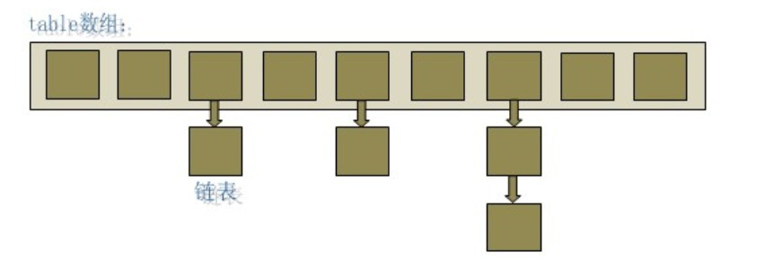

### 深入理解HashMap实现
    
##### 什么是HashMap？

HashMap是Java程序员必须掌握的知识点，也是面试中的常考点。 HashMap的主要作用是加快查找速度,我们学过数据结构的都知道，数组的查询和修改速度很快，但是增加一个元素或者删除一个元素就很慢，但是链表就反过来，链表是增加和删除一个元素很快，查询和修改就很慢。**通常来说，我们为了提高查询的速度，那么在插入元素的时候就要定义各种规则，就是增加复杂度了。 有不理解的可以
查询相关算法书里 查找这一章。而我们的hashmap正是将数组和链表结合起来增加查询速度的一种数据结构。

##### HashMap的数据结构
HashMap 就是通过数组+链表数据结构进行实现。HashMap实际上是一个“链表散列”的数据结构，即数组和链表的结合体。


通过 JDK 中的 HashMap 源码进行一些学习，首先看一下构造函数：
```
public HashMap(int initialCapacity, float loadFactor) {
        if (initialCapacity < 0)
            throw new IllegalArgumentException("Illegal initial capacity: " +initialCapacity);
        if (initialCapacity > MAXIMUM_CAPACITY)
            initialCapacity = MAXIMUM_CAPACITY;
        if (loadFactor <= 0 || Float.isNaN(loadFactor))
            throw new IllegalArgumentException("Illegal load factor: " +
                                               loadFactor);
        this.loadFactor = loadFactor;
        this.threshold = tableSizeFor(initialCapacity);
    }
```
可以看出在构造函数，仅仅是堆loadFactor、threshold参数就行赋值。实际并未进行初始化操作。HashMap的初始化工作将会putVal方法中检查是否初始化。

##### HashMap的putVal方法

putVal为HashMap的核心方法，
``````
 final V putVal(int hash, K key, V value, boolean onlyIfAbsent,
                   boolean evict) {
        Node<K,V>[] tab; Node<K,V> p; int n, i;
        //如果table 为空或者tab的长度为0,调用resize()进行初始化
        if ((tab = table) == null || (n = tab.length) == 0)
            n = (tab = resize()).length;
        //i位置为null，则newNode新节点
        if ((p = tab[i = (n - 1) & hash]) == null)
            tab[i] = newNode(hash, key, value, null);
        else {
            Node<K,V> e; K k;
            //hash值相同，key相同则直接替换e
            if (p.hash == hash &&
                ((k = p.key) == key || (key != null && key.equals(k))))
                e = p;
            //p节点是红黑树
            else if (p instanceof TreeNode)
                e = ((TreeNode<K,V>)p).putTreeVal(this, tab, hash, key, value);
            else {
                //链表，binCount用于统计链表长度，大于8时转化为红黑树
                for (int binCount = 0; ; ++binCount) {
                    if ((e = p.next) == null) {
                        p.next = newNode(hash, key, value, null);
                        if (binCount >= TREEIFY_THRESHOLD - 1) // -1 for 1st
                            treeifyBin(tab, hash);
                        break;
                    }
                    if (e.hash == hash &&
                        ((k = e.key) == key || (key != null && key.equals(k))))
                        break;
                    p = e;
                }
            }
            //前面都只是对e赋值，afterNodeAccess加入
            if (e != null) { // existing mapping for key
                V oldValue = e.value;
                if (!onlyIfAbsent || oldValue == null)
                    e.value = value;
                afterNodeAccess(e);
                return oldValue;
            }
        }
        ++modCount;
        //超过伐值，进行扩容
        if (++size > threshold)
            resize();
        afterNodeInsertion(evict);
        return null;
    }
``````
HashMap的put方法是通过调用return putVal(hash(key), key, value, false, true);

##### HashMap中的resize（）方法

```
final Node<K,V>[] resize() {
        Node<K,V>[] oldTab = table;
        //检查oldTab是否为空，为空则设置初始容量为threshold
        int oldCap = (oldTab == null) ? 0 : oldTab.length;
        int oldThr = threshold;
        int newCap, newThr = 0;
        if (oldCap > 0) {
            if (oldCap >= MAXIMUM_CAPACITY) {
                threshold = Integer.MAX_VALUE;
                return oldTab;
            }
            else if ((newCap = oldCap << 1) < MAXIMUM_CAPACITY &&
                     oldCap >= DEFAULT_INITIAL_CAPACITY)
                newThr = oldThr << 1; // double threshold
        }
        else if (oldThr > 0) // initial capacity was placed in threshold
            newCap = oldThr;
        else {               // zero initial threshold signifies using defaults
            newCap = DEFAULT_INITIAL_CAPACITY;
            newThr = (int)(DEFAULT_LOAD_FACTOR * DEFAULT_INITIAL_CAPACITY);
        }
        if (newThr == 0) {
            float ft = (float)newCap * loadFactor;
            newThr = (newCap < MAXIMUM_CAPACITY && ft < (float)MAXIMUM_CAPACITY ?
                      (int)ft : Integer.MAX_VALUE);
        }
        threshold = newThr;
        //上面通过一系列操作。根据加载因子和当前容量，计算出扩容大小
        @SuppressWarnings({"rawtypes","unchecked"})
        Node<K,V>[] newTab = (Node<K,V>[])new Node[newCap];
        table = newTab;
        if (oldTab != null) {
            for (int j = 0; j < oldCap; ++j) {
                Node<K,V> e;
                if ((e = oldTab[j]) != null) {
                    oldTab[j] = null;
                    if (e.next == null)
                        newTab[e.hash & (newCap - 1)] = e;
                    else if (e instanceof TreeNode)
                        ((TreeNode<K,V>)e).split(this, newTab, j, oldCap);
                    else { // preserve order
                         //这个链表用来表示扩充以后 新增bit为0的链表 也就是说这个链表上的元素扩充前后位置不变
                        Node<K,V> loHead = null, loTail = null;
                         //这个用来表示扩充以后要挪动位置的链表 挪动位置也就是说新增的bit为1了。
                        Node<K,V> hiHead = null, hiTail = null;
                        Node<K,V> next;
                        do {
                            next = e.next;
                            if ((e.hash & oldCap) == 0) {
                                if (loTail == null)
                                    loHead = e;
                                else
                                    loTail.next = e;
                                loTail = e;
                            }
                            else {
                                if (hiTail == null)
                                    hiHead = e;
                                else
                                    hiTail.next = e;
                                hiTail = e;
                            }
                        } while ((e = next) != null);
                        if (loTail != null) {
                            loTail.next = null;
                            newTab[j] = loHead;
                        }
                        if (hiTail != null) {
                            hiTail.next = null;
                            newTab[j + oldCap] = hiHead;
                        }
                    }
                }
            }
        }
        return newTab;
```

**考虑如下场景：**
  
初始长度为16的数组，我们加入2个元素 一个hashcode是5 一个hashcode是21. 我们对16取余之后，计算出来的索引位置  5 对应的是a[5],21对应的是也是a[5] 于是这2个就存在同一个链表中。

当元素越来越多终于超过阈值的时候，数组扩充到32这个长度，这个时候5 和21 再对32取余,5对应的还是a[5],而21对应的就是a[21] 这个位置了，我们注意 21这个hashcode，之前对应的位置是在a[5] 扩充一倍以后在21 位置增加了16 ，这个16 实际上就是扩充的长度，这个数学公式可以抽象为

扩充前位置 oldIndex扩充后位置 要么保持不变 要么是oldIndex+扩充前的长度.
有了这套数学规律，我们在resize的时候就可以优化一下了，不需要像jdk7中重新计算hash和index了。

JDK7中HashMap在多线程环境下使用会造成CPU利用率100%，也就是在扩容的时候造成死循环，在JDK8中这样的情况不再有，就是因为JDK优化Resize函数。原因就是因为JDK7中reHash过程后链表会倒置，行成环状造成死循环。而JDK8以后，reSize不会重新取Hash值，根据if ((e.hash & oldCap) == 0) 即在原位置，或者原位置一倍的位置，即如上场景中21 取余位置为21，为21-16 =5 ，二倍扩容第二个相同链表同位置，所以链表顺序不会倒置。因而不会产生环状。

##### HashMap进行Get操作

``````
final Node<K,V> getNode(int hash, Object key) {
         /**
          * 先定位到数组元素，再遍历该元素处的链表
          * 判断的条件是key的hash值相同，并且链表的存储的key值和传入的key值相同
          */
        Node<K,V>[] tab; Node<K,V> first, e; int n; K k;
        if ((tab = table) != null && (n = tab.length) > 0 &&
            (first = tab[(n - 1) & hash]) != null) {
            if (first.hash == hash && // always check first node
                ((k = first.key) == key || (key != null && key.equals(k))))
                return first;
            if ((e = first.next) != null) {
                if (first instanceof TreeNode)
                    return ((TreeNode<K,V>)first).getTreeNode(hash, key);
                do {
                    if (e.hash == hash &&
                        ((k = e.key) == key || (key != null && key.equals(k))))
                        return e;
                } while ((e = e.next) != null);
            }
        }
        return null;
    }
``````

##### HashMap 为什么要加入红黑树？

当HashMap中链表长度>8时候，会自动转化为红黑树，HashMap的Hash值范围是-2147483648到2147483648，约40亿个数据。当正常散列时候回分布均匀。如果链表过长，则一定是HashCode函数为写完美，重写equals方法的时候一定要重写HashCode方法（二个对象相等，则他们Hashcode一定相同；二个对象hashcode相等，他们不一定是一个对象）。hashCode其实就是一个浅层的判断对象是否相等，比较大量数据是否相等时候，只用比较Hashcode相同的对象。加入红黑树的目的是为了在错误使用的情况下（HashCode方法未重写，或者重写失败），仍然能够保持HashMap的性能的考虑。

##### 多线程环境下使用HashMap

众所周知的hashmap明显是不支持线程同步的，最大的原因就是hashmap的resize过程中极易被线程干扰，很有可能中间的resize操作 transfer操作 的执行顺序被打乱，要知道transfer操作的是链表，很容易出现 你指向我我指向你这种循环链表，一旦出现循环链表的情况，基本程序就是死循环要报错了。


hashtable就是采用的比较极端的方法，直接对put方法进行加锁了。这样虽然一劳永逸，但是效率极低。 不推荐使用。 

当然我们还可以换一种方法。
```
HashMap hm=new HashMap();
Collections.synchronizedMap(hm);
```
这样也可以保持线程同步。看看原理：
```
public static <K,V> Map<K,V> synchronizedMap(Map<K,V> m) {
        return new SynchronizedMap<>(m);
    }

    /**
     * @serial include
     */
    private static class SynchronizedMap<K,V>
        implements Map<K,V>, Serializable {
        private static final long serialVersionUID = 1978198479659022715L;

        private final Map<K,V> m;     // Backing Map
        final Object      mutex;        // Object on which to synchronize

        SynchronizedMap(Map<K,V> m) {
            this.m = Objects.requireNonNull(m);
            mutex = this;
        }

        SynchronizedMap(Map<K,V> m, Object mutex) {
            this.m = m;
            this.mutex = mutex;
        }

        public int size() {
            synchronized (mutex) {return m.size();}
        }
        public boolean isEmpty() {
            synchronized (mutex) {return m.isEmpty();}
        }
        public boolean containsKey(Object key) {
            synchronized (mutex) {return m.containsKey(key);}
        }
        public boolean containsValue(Object value) {
            synchronized (mutex) {return m.containsValue(value);}
        }
        public V get(Object key) {
            synchronized (mutex) {return m.get(key);}
        }

        public V put(K key, V value) {
            synchronized (mutex) {return m.put(key, value);}
        }
        public V remove(Object key) {
            synchronized (mutex) {return m.remove(key);}
        }
        public void putAll(Map<? extends K, ? extends V> map) {
            synchronized (mutex) {m.putAll(map);}
        }
        public void clear() {
            synchronized (mutex) {m.clear();}
        }

        private transient Set<K> keySet;
        private transient Set<Map.Entry<K,V>> entrySet;
        private transient Collection<V> values;

```
比hashtable好一点，但是锁加的还是太多了。有提升但是依旧不够好。
HashMap设计的初衷就不是在多线程环境下使用的，何必要求太多呢？如需线程安全HashMap，请使用ConcurrentHashMap，ConcurrentHashMap 才是解决此类问题的最终方案,以上是通过jdk11分析得出。

参考文章：  
[深入理解HashMap上篇](http://xujin.org/java/hm01/#1-1-HashMap%E7%9A%84%E6%95%B0%E6%8D%AE%E7%BB%93%E6%9E%84)  
[深入理解HashMap（一）](https://juejin.im/post/5a6694e8f265da3e347b63c7)  
[深入理解hashmap（二）理论篇](https://juejin.im/post/5be4e93b6fb9a049e7019af0)  
[深入理解HashMap](https://www.jianshu.com/p/cb229f538ec9)  
[Oracle HashMap<K,V>](https://docs.oracle.com/javase/8/docs/api/java/util/HashMap.html)  
[HashMap in Java](https://www.geeksforgeeks.org/java-util-hashmap-in-java/)  
