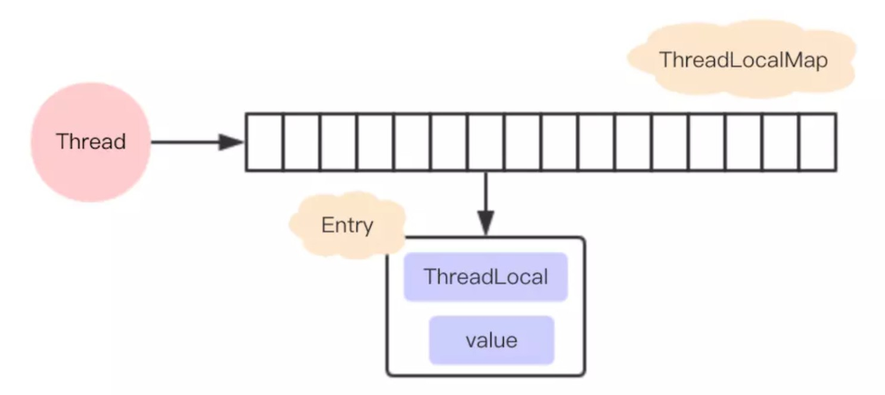

### ThreadLocal解析
  
ThreadLocal是一个关于创建线程局部变量的类。
  
通常情况下，我们创建的变量是可以被任何一个线程访问并修改的。而使用ThreadLocal创建的变量只能被当前线程访问，其他线程则无法访问和修改。  
  
它是一个数据结构，有点像HashMap，可以保存"key : value"键值对，但是一个ThreadLocal只能保存一个，并且各个线程的数据互不干扰
***
#### 用法简介
创建、支持泛型
```
ThreadLocal<String> mStringThreadLocal = new ThreadLocal<>();
```
set方法
```
mStringThreadLocal.set("focusup.github.io");
```
get方法
```
mStringThreadLocal.get();
```
完整使用示例
```
private void testThreadLocal() {
    Thread t = new Thread() {
        ThreadLocal<String> mStringThreadLocal = new ThreadLocal<>();

        @Override
        public void run() {
            super.run();
            mStringThreadLocal.set("focusup.github.io");
            mStringThreadLocal.get();
        }
    };

    t.start();
}
```
ThreadLocal保证了各个线程的数据互不干扰,来看看怎么实现的
***
#### ThreadLocal 实现

set(T value)和get()方法的源码   
```
public T get() {
        Thread t = Thread.currentThread();
        ThreadLocalMap map = getMap(t);
        if (map != null) {
            ThreadLocalMap.Entry e = map.getEntry(this);
            if (e != null) {
                @SuppressWarnings("unchecked")
                T result = (T)e.value;
                return result;
            }
        }
        return setInitialValue();
    }

ThreadLocalMap getMap(Thread t) {
        return t.threadLocals;
    }

public void set(T value) {
    Thread t = Thread.currentThread();
    ThreadLocalMap map = getMap(t);
    if (map != null) {
         map.set(this, value);
    } else {
        createMap(t, value);
    }
}
```

每个线程中都有一个ThreadLocalMap数据结构，当执行set方法时，其值是保存在当前线程的threadLocals变量中，当执行set方法中，是从当前线程的threadLocals变量获取。
  
所以在线程1中set的值，对线程2来说是摸不到的，而且在线程2中重新set的话，也不会影响到线程1中的值，保证了线程之间不会相互干扰。
  
那每个线程中的ThreadLoalMap究竟是什么？
***
#### ThreadLoalMap

在ThreadLoalMap中，也是初始化一个大小16的Entry数组，Entry对象用来保存每一个key-value键值对，只不过这里的key永远都是ThreadLocal对象，是不是很神奇，通过ThreadLocal对象的set方法，结果把ThreadLocal对象自己当做key，放进了ThreadLoalMap中。

***
#### hash冲突
ThreadLoalMap是没有链表结构，那发生hash冲突的时候怎么办？

先看看ThreadLoalMap中插入一个key-value的实现
```
private void set(ThreadLocal<?> key, Object value) {

            // We don't use a fast path as with get() because it is at
            // least as common to use set() to create new entries as
            // it is to replace existing ones, in which case, a fast
            // path would fail more often than not.

            Entry[] tab = table;
            int len = tab.length;
            int i = key.threadLocalHashCode & (len-1);

            for (Entry e = tab[i];
                 e != null;
                 e = tab[i = nextIndex(i, len)]) {
                ThreadLocal<?> k = e.get();

                if (k == key) {
                    e.value = value;
                    return;
                }

                if (k == null) {
                    replaceStaleEntry(key, value, i);
                    return;
                }
            }

            tab[i] = new Entry(key, value);
            int sz = ++size;
            if (!cleanSomeSlots(i, sz) && sz >= threshold)
                rehash();
        }
```
每个ThreadLocal对象都有一个hash值threadLocalHashCode，每初始化一个ThreadLocal对象，hash值就增加一个固定的大小0x61c88647。
在插入过程中，根据ThreadLocal对象的hash值，定位到table中的位置i，过程如下：
1、如果当前位置是空的，那么正好，就初始化一个Entry对象放在位置i上；
2、不巧，位置i已经有Entry对象了，如果这个Entry对象的key正好是即将设置的key，那么重新设置Entry中的value；
3、很不巧，位置i的Entry对象，和即将设置的key没关系，那么只能找下一个空位置；
***
#### Entry的实现：
```
 static class Entry extends WeakReference<ThreadLocal<?>> {
            /** The value associated with this ThreadLocal. */
            Object value;

            Entry(ThreadLocal<?> k, Object v) {
                super(k);
                value = v;
            }
        }
```
Entry是ThreadLocalMap的内部类，ThreadLocalMap内部就是创建Entry 来保存的ThreadLocal。
这里要注意Entry 继承的弱引用，即只要垃圾回收执行，这个对象便会被回收。

那么为什么要使用弱引用呢？  

在使用线程池的情况下，核心线程是不断复用不会被回收的，而ThreadLocalMap是与线程绑定的，因此会一直保留对ThreadLocalMap的引用。（即垃圾回收无法回收掉ThreadLocalMap）

如果不使用弱引用，那么在线程替换了一个Runnable之后，之前的Runnable用ThreadLocal存储的对象还会存在，并且不会被回收，这就发生了真正意义上的内存泄露，并且随着线程的复用次数的提高，ThreadLocalMap中的对象一直不会被回收，很可能会造成OOM。


本文基于JDK11分析
***
参考： 

[ThreadLocal原理解析（2）：ThreadLocalMap源码解析](https://blog.csdn.net/huachao1001/article/details/51734973)  
[ThreadLocal与ThreadLocalMap源码解析](https://blog.csdn.net/Double2hao/article/details/76074079)  
[理解Java中的ThreadLocal](https://droidyue.com/blog/2016/03/13/learning-threadlocal-in-java/)  
[ThreadLocal就是这么简单](https://juejin.im/post/5ac2eb52518825555e5e06ee)  
[Java面试必问，ThreadLocal终极篇](https://www.jianshu.com/p/377bb840802f)


